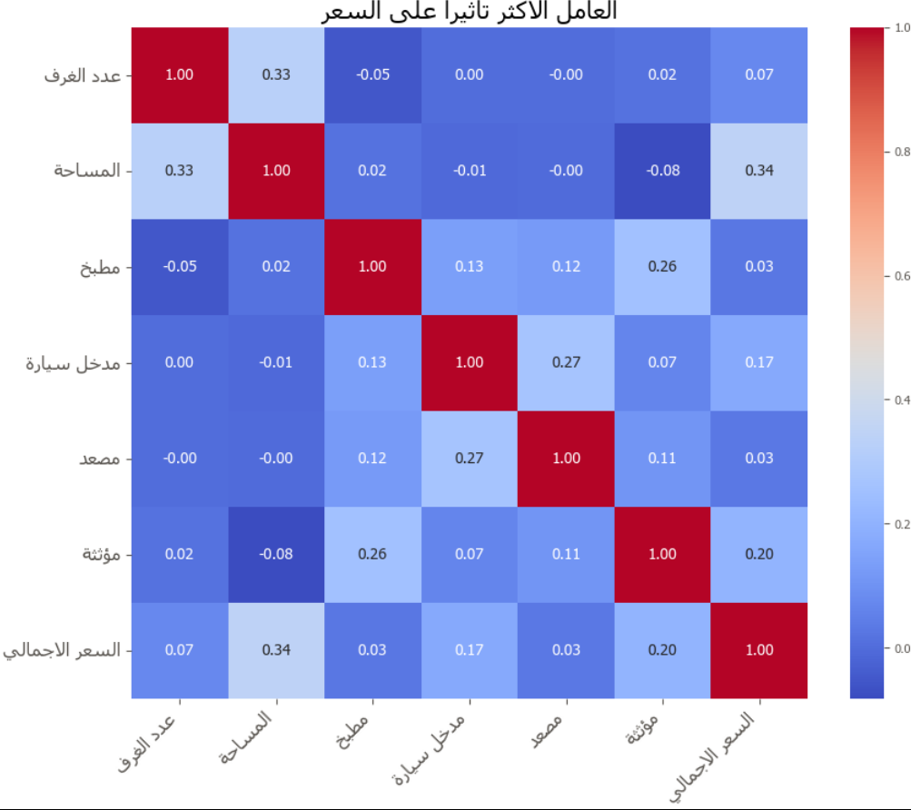
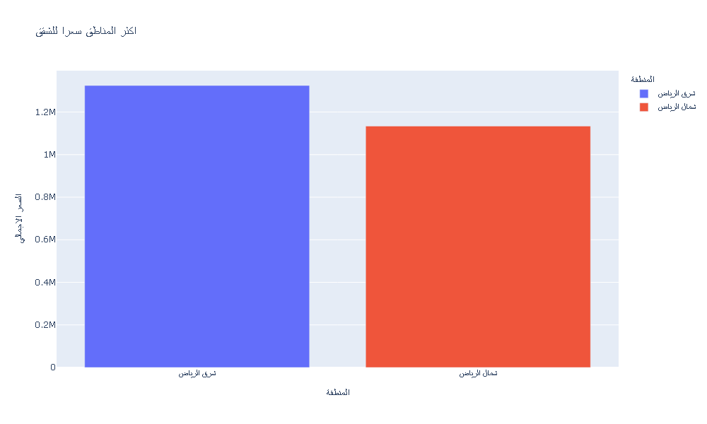
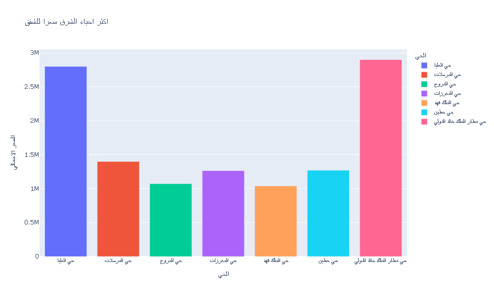
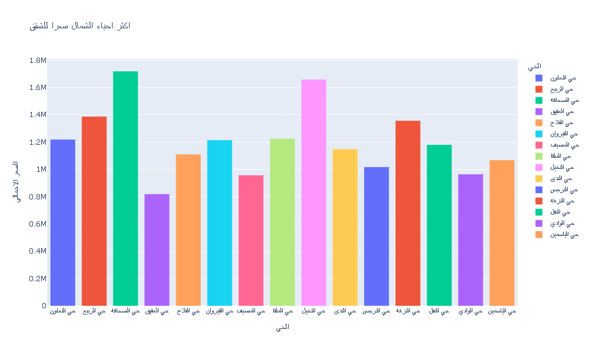
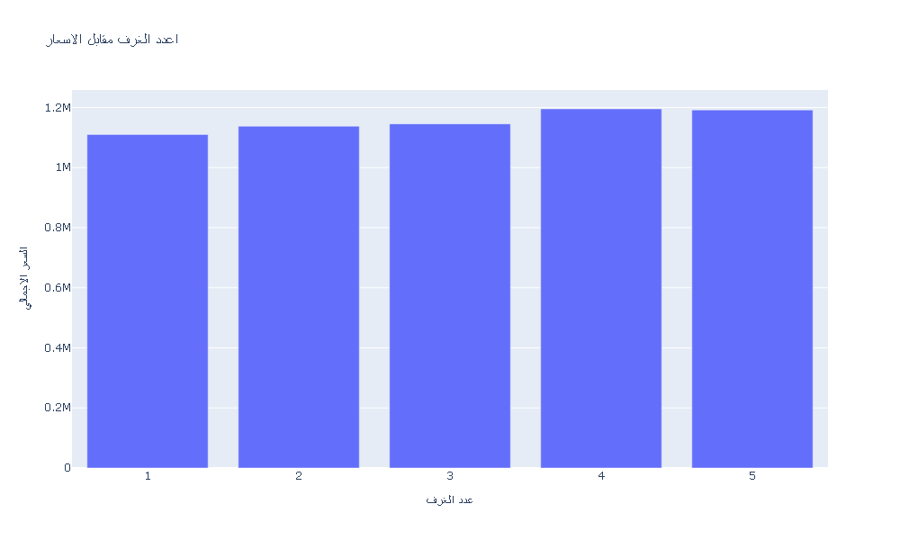
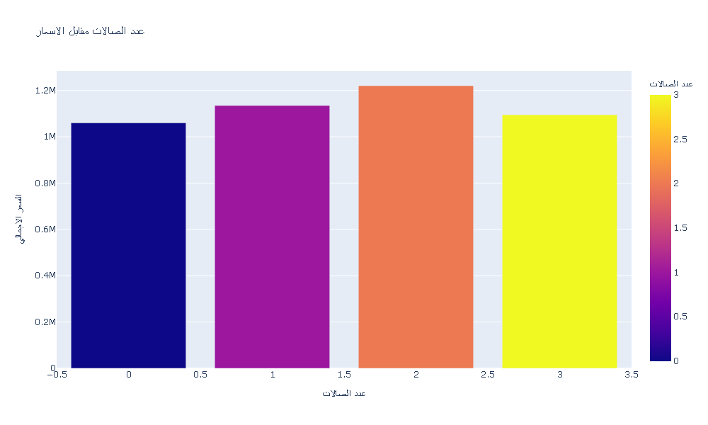
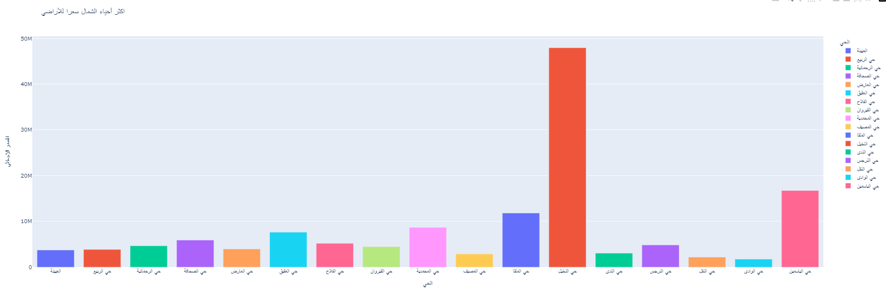
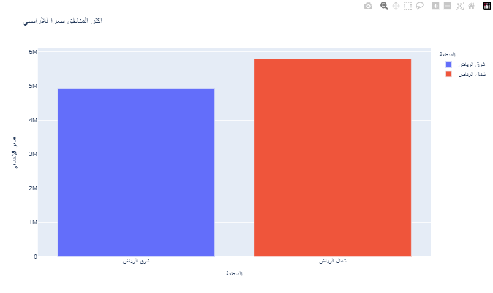
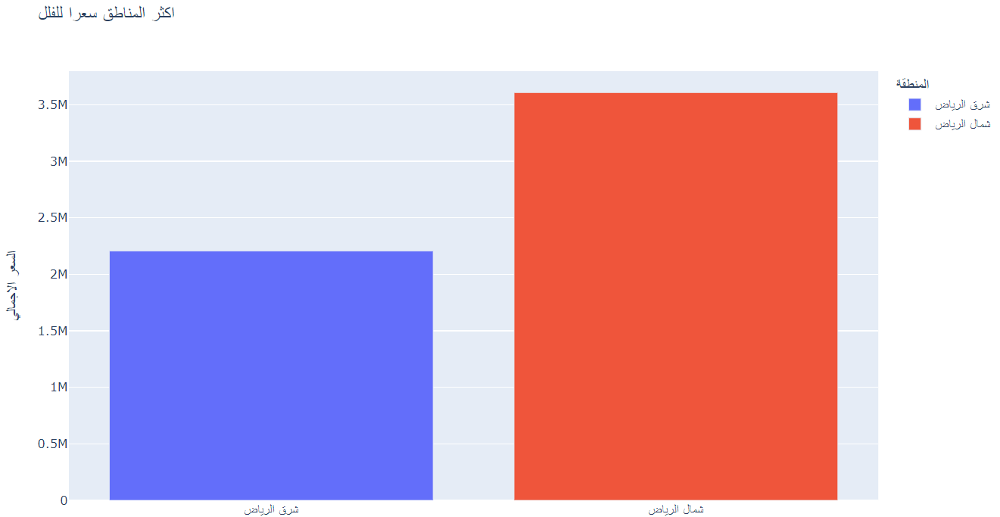

# Usecase-6-Project-3

## Final Deliverables:
- Firas Almoqhim
- Musab Alsobhi
- Ali Alfaris
- Osamah Alharbi 

## Introduction (Problem, Objectives)
The "Riyadh Aqaar Dataset" three distinct data sets, each focusing on a specific type of real estate in Riyadh, Saudi Arabia. These data sets provide a detailed look into different segments of the Riyadh property market:
1.	Apartments Data: This dataset includes information about various apartments available in Riyadh. It features details such as apartment size, number of bedrooms, district, and asking price. Analyzing this data can help identify trends in apartment prices and preferences, as well as spot areas with high demand.
2.	Lands Data: This set provides information on plots of land for sale in Riyadh. It includes key details such as land size, district, and price per meter. By examining this dataset, you can gain insights into the land market, including which areas are seeing growth or which sizes are most popular.
3.	Houses Data: This dataset focuses on houses available in Riyadh. It contains information about house features like the number of rooms, size, district, and price. This data is useful for understanding trends in the housing market, such as popular neighborhoods or price ranges for different types of houses.
Together, these datasets offer a comprehensive view of the real estate market in Riyadh, allowing for in-depth analysis and comparisons across apartments, land, and houses. Whether you're looking to understand market trends, make investment decisions, or explore property values, these datasets provide a valuable resource.

## Dataset Overview and Source:
The datasets cover three types of real estate properties in Riyadh: lands, villas, and apartments. Lands Dataset: Focuses on land properties, with the most important column being the Total Price. This helps in understanding land costs across different areas in Riyadh. Villas Dataset: Provides details about villas, with key columns being the Number of Rooms and Total Price. This dataset is useful for analyzing villa features and pricing. Apartments Dataset: Similar to the villas dataset but focused on apartments. The Total Price and Number of Rooms are the most important for comparing apartment prices and sizes. Differences Between the Datasets Property Type: Lands focus on price and size, while villas and apartments include more details like room count. Use Cases: Lands are for raw property analysis, while villas and apartments help in understanding residential markets. The Riyadh Aqaar dataset on Kaggle was created by a user named Faisal. The source of the data is not explicitly mentioned, which might affect its reliability depending on how it was collected.

# List of EDA steps that applied on data with description:
## Data Profiling:
First, we tried to understand the data structure including tables, columns, and data types. 
In summary we wanted to know everything about the datasets. 

## 1-Reliability: 
We checked the source of the datasets its must be reliable which it was, the datasets its from aqaar 
And its reliable.

## 2-Timeliness: 
Unfortunately, the datasets its not up-to-date (2023), but lucky for us we can use the datasets.

 ## 3-Consistency:
All the datasets are consistent since when we checked the values of each dataset across the three files.

## 4-Relevance:
We checked that the data is appropriate and applicable for the intended analysis since there is no columns that must be dropped. 

## 5-Uniqueness:
We checked that no rows need to be dropped, and it was unique.

## 6-Completeness:
We saw that there are missing values, and we handled them appropriately. 

## 7-Check Accuracy:
We changed some of the data types, and we get rid of the outliers. 

# Describe the final ten insights with their charts:

- The space is the most signficant factor that con impact the prices,
meanwhile, most of the customers doesn't care if there is an elvator in the propraty they are intersted in.

- Most of the prices in riaydh are high and the east part has the biggest share

- The king fahad neighborhood has the lowest prices becuase it is still under construction.

 

 - The high prices on alnakhel and alshafah niebrhoods are becuase they are near to KAFD and Boulevard World.

- There is no big diffrence on prices if the apartmnet include one room or six rooms,
so the impact on prices comes most from where it located or thier space.

- There are a high numbers of apartments that has no lounges because most of Riyadh residents are here work and they don't wan't to put extra money to have a lounge in thier apartements.

- Al Nakheel neighborhood is the lead by difference as expected if we add the second and third position we will not reach Al Nakheel neighborhood. 

- As we see the difference between them are very close which tells us if you want to buy or infest in Riyadh you must have at least 6M.

- As we see that neighborhoods from the east distract in the top 3 except Al Nakheel neighborhoods is from north, but the rest of the top 10 are all from the north which is something usual.

- This chart is comparison between north and east districts, the north is expensive more than east by almost double.

  
## The link for our streamlit story app is under below

- https://appgit-qyzhtzrgzabdvlzn2iycwr.streamlit.app/

